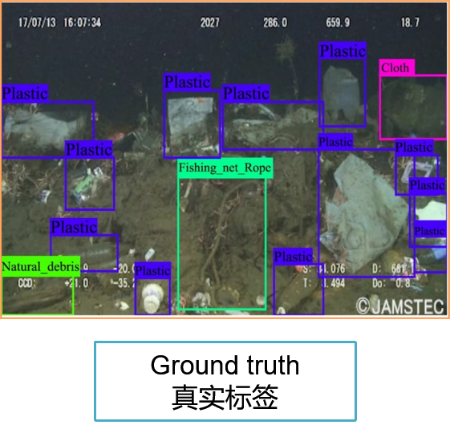
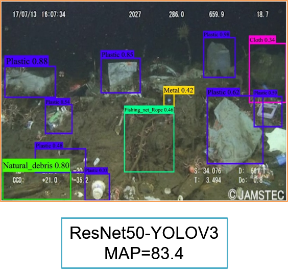

# Debris-detection

This is a PyTorch/GPU  code of the paper [Deep-Sea Debris Identification Using Deep
Convolutional Neural Networks](https://ieeexplore.ieee.org/stamp/stamp.jsp?tp=&arnumber=9524516))

```
@ARTICLE{Deep-SeaDebrisIdentification,
author={Xue, Bing and Huang, Baoxiang and Chen, Ge and Li, Haitao and Wei, Weibo},
journal={IEEE Journal of Selected Topics in Applied Earth Observations and Remote Sensing}, 
title={Deep-Sea Debris Identification Using Deep Convolutional Neural Networks}, 
year={2021},
volume={14},
number={},
pages={8909-8921},
doi={10.1109/JSTARS.2021.3107853}}
```

## Examples

<figure class="half">


</figyure>


